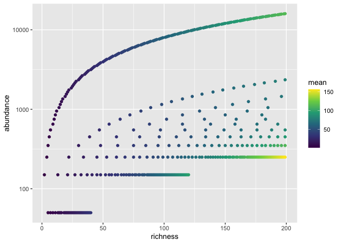
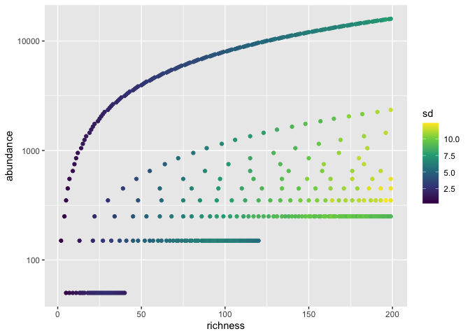
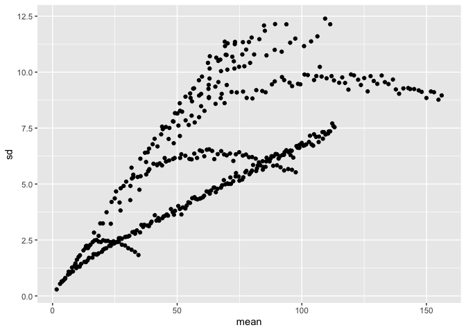
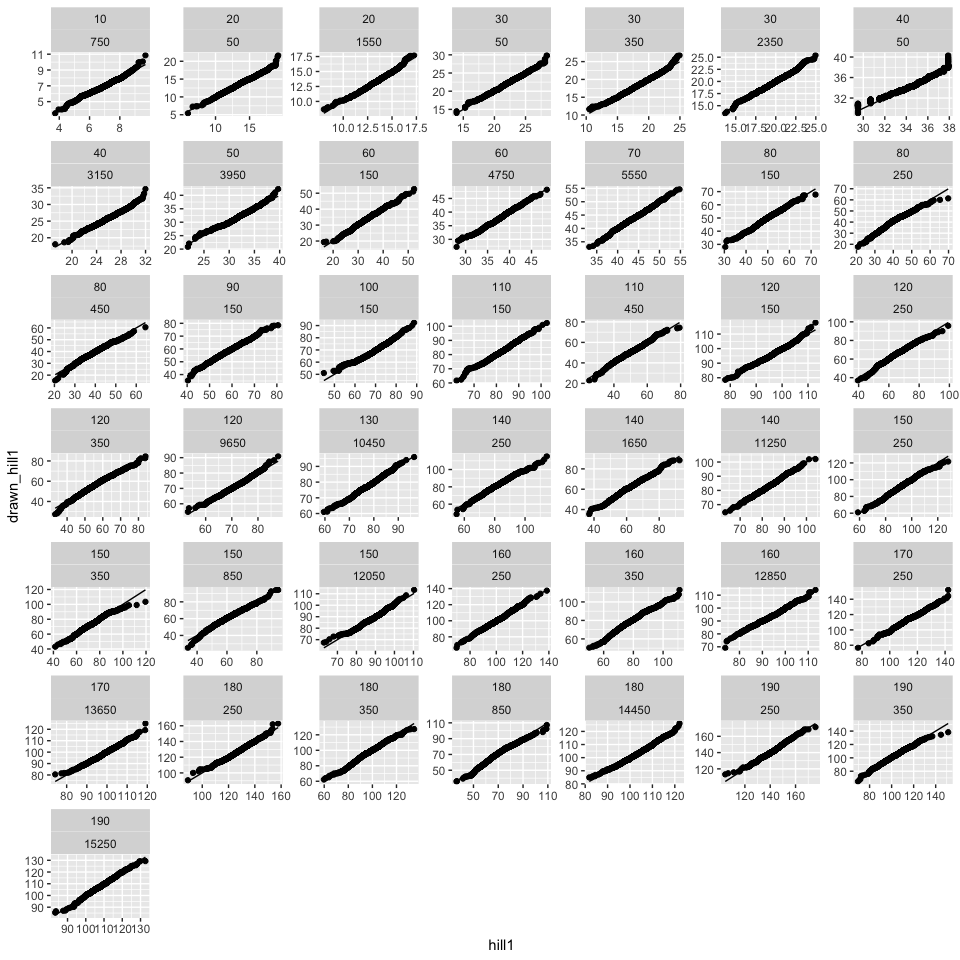
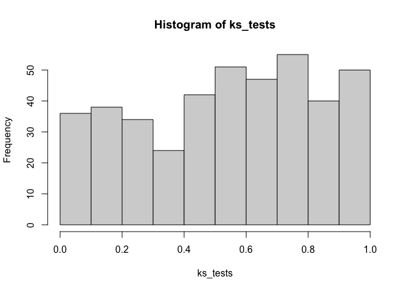

moments
================

``` r
targets::tar_load("all", store = here::here("_targets"))
```

``` r
all_moments <- all %>%
  group_by(richness, abundance) %>%
  summarize(mean = mean(hill1),
            sd = sd(hill1)) %>%
  ungroup()
```

    ## `summarise()` has grouped output by 'richness'. You can override using the
    ## `.groups` argument.

``` r
ggplot(all_moments, aes(richness, abundance, color = mean)) +
  geom_point() +
  scale_y_log10() +
  scale_color_viridis_c()
```

<!-- -->

``` r
ggplot(all_moments, aes(richness, abundance, color = sd)) +
  geom_point() +
  scale_y_log10() +
  scale_color_viridis_c()
```

<!-- -->

``` r
ggplot(all_moments, aes(mean, sd)) +
  geom_point()
```

<!-- -->

``` r
gdraws <- function(a_row) {
  
  richness = a_row[1]
  abundance = a_row[2]
  
  vals = rnorm(1000, mean = a_row[3], sd = a_row[4])
  
  return(data.frame(richness = richness,
                    abundance = abundance,
                    drawn_hill1 = vals))
  
}
```

``` r
pull_vals <- function(a_row, all_df) {
  
  vals <- all_df %>%
    filter(richness == a_row[1],
           abundance == a_row[2])
  
  keepvals <- sample(vals$hill1, 1000)
  
  return(data.frame(richness = a_row[1],
                    abundance = a_row[2],
                    hill1 = keepvals))
  
}
```

``` r
moments_draws <- apply(all_moments, MARGIN = 1, FUN = gdraws)

moments_draws <- bind_rows(moments_draws)

fs_draws <-  apply(all_moments, MARGIN = 1, FUN = pull_vals, all_df = all)
fs_draws <- bind_rows(fs_draws)
```

``` r
draws_compares <- cbind(fs_draws, moments_draws)
draws_compares <- draws_compares[c(1:3, 6)]
draws_compares <- draws_compares %>%
  group_by(richness, abundance) %>%
  mutate(hill1 = sort(hill1),
         drawn_hill1 = sort(drawn_hill1))
```

``` r
ggplot(filter(draws_compares, richness %in% seq(0, 200, by = 10)), aes(hill1, drawn_hill1)) +
  geom_point() +
  geom_line(aes(y = hill1)) +
  facet_wrap(vars(richness, abundance), scales = "free")
```

<!-- -->

``` r
perform_ks_test <- function(a_row, dc_df) {
  
  vals <- dc_df %>%
    filter(richness == a_row[1],
           abundance == a_row[2])
  
  
  ks_test <- ks.test(vals$hill1, vals$drawn_hill1)
  
  return(ks_test$p.value)
}


ks_tests <- apply(all_moments, 1, FUN = perform_ks_test, dc_df = draws_compares)

hist(ks_tests)
```

<!-- -->

``` r
mean(ks_tests < .05)
```

    ## [1] 0.04316547
