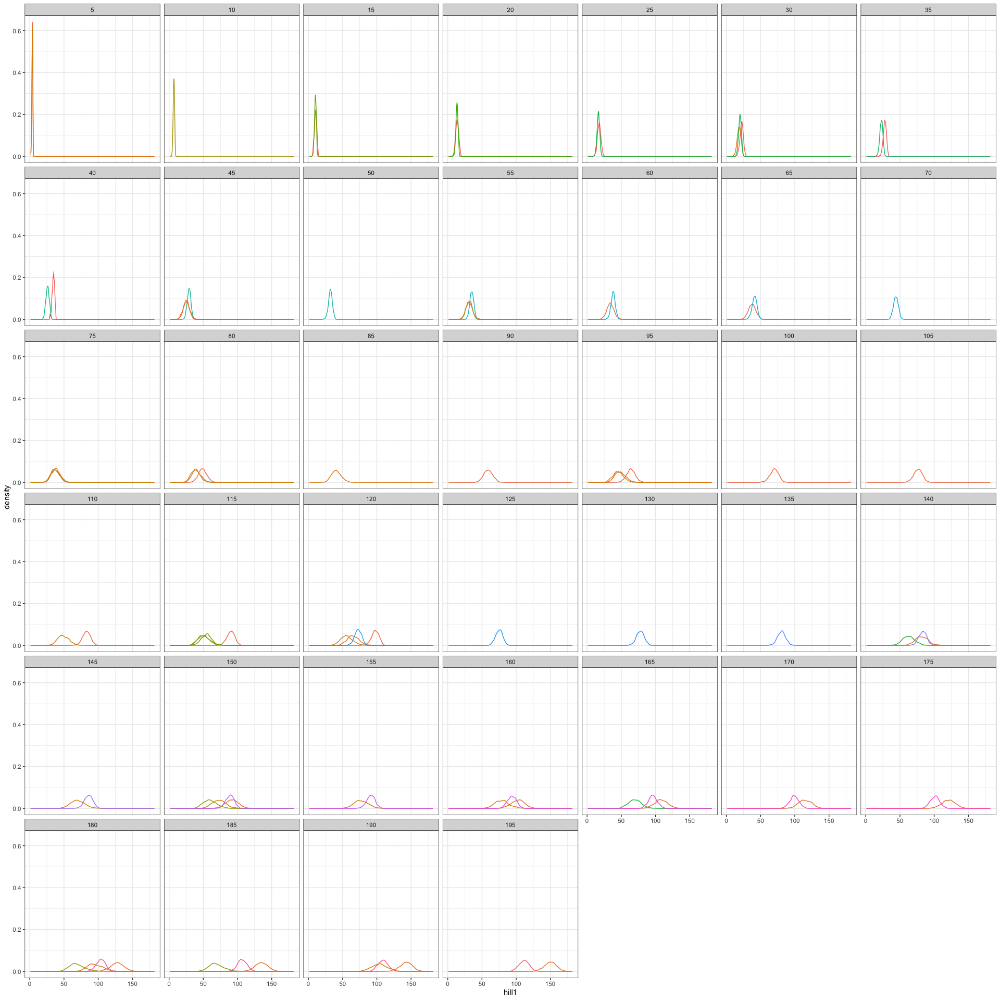
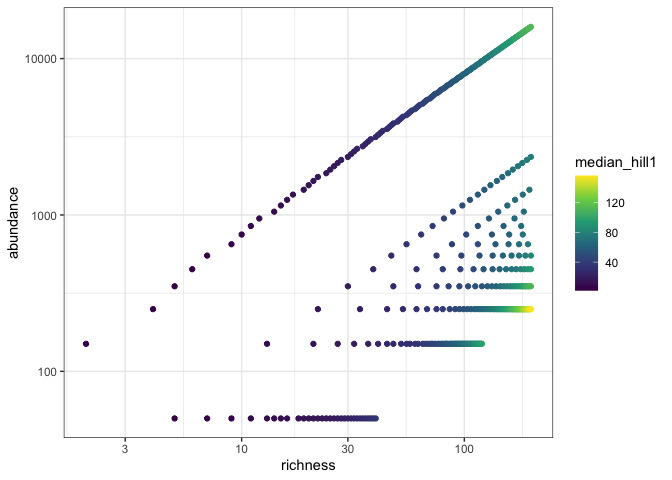
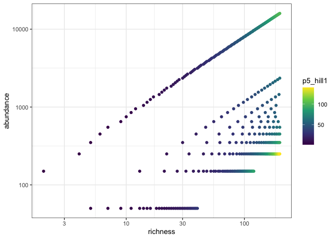
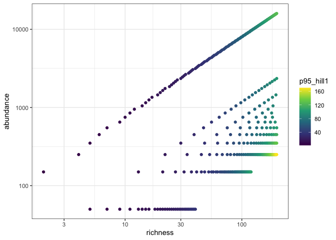

feasible-cache viz
================

``` r
targets::tar_load("all", store = here::here("_targets"))
```

``` r
head(all)
```

    ## # A tibble: 6 × 7
    ##    draw source   richness abundance  even hill1 hill2
    ##   <dbl> <chr>       <int>     <dbl> <dbl> <dbl> <dbl>
    ## 1     1 feasible        5        50 0.774  4.69  4.42
    ## 2     2 feasible        5        50 0.742  4.15  3.87
    ## 3     3 feasible        5        50 0.682  3.53  3.15
    ## 4     4 feasible        5        50 0.790  4.88  4.77
    ## 5     5 feasible        5        50 0.652  3.61  2.87
    ## 6     6 feasible        5        50 0.707  3.98  3.42

``` r
unique(all$richness)
```

    ##   [1]   5   7   9  11  13  14  15  16  18  19  20  21  22  23  24  25  26  27
    ##  [19]  28  29  30  31  32  33  34  35  36  37  38  39  40   2  41  45  48  52
    ##  [37]  55  57  60  62  65  67  69  71  72  74  76  77  79  80  82  83  84  86
    ##  [55]  87  88  89  90  91  92  93  94  95  96  97  98  99 100 101 102 103 104
    ##  [73] 105 106 107 108 109 110 111 112 113 114 115 116 117 118 119 120   4  53
    ##  [91]  61  68  75 123 126 129 131 134 136 138 140 142 144 146 148 150 151 153
    ## [109] 154 156 157 159 160 162 163 164 165 166 168 169 170 171 172 173 174 175
    ## [127] 176 177 178 179 180 181 182 183 184 185 186 187 188 189 190 191 192 193
    ## [145] 194 195 196 197 198 199  85 127 133 139 145 155   6 122  47 149 158  10
    ## [163]  64  12  81  17  42  43  46  50  51  56  58  63  66  70  73  78 124 125
    ## [181] 128 130 132 135 137 143 147 152

``` r
unique(all$abundance)
```

    ##   [1]    50   150   250   350   450   550   650   750   850   950  1050  1150
    ##  [13]  1250  1350  1450  1550  1650  1750  1850  1950  2050  2150  2250  2350
    ##  [25]  2450  2550  2650  2750  2850  2950  3050  3150  3250  3350  3450  3550
    ##  [37]  3650  3750  3850  3950  4050  4150  4250  4350  4450  4550  4650  4750
    ##  [49]  4850  4950  5050  5150  5250  5350  5450  5550  5650  5750  5850  5950
    ##  [61]  6050  6150  6250  6350  6450  6550  6650  6750  6850  6950  7050  7150
    ##  [73]  7250  7350  7450  7550  7650  7750  7850  7950  8050  8150  8250  8350
    ##  [85]  8450  8550  8650  8750  8850  8950  9050  9150  9250  9350  9450  9550
    ##  [97]  9650  9750  9850  9950 10050 10150 10250 10350 10450 10550 10650 10750
    ## [109] 10850 10950 11050 11150 11250 11350 11450 11550 11650 11750 11850 11950
    ## [121] 12050 12150 12250 12350 12450 12550 12650 12750 12850 12950 13050 13150
    ## [133] 13250 13350 13450 13550 13650 13750 13850 13950 14050 14150 14250 14350
    ## [145] 14450 14550 14650 14750 14850 14950 15050 15150 15250 15350 15450 15550
    ## [157] 15650 15750 15850 15950

``` r
# 
# ggplot(all, aes(hill1)) + 
#   geom_density() +
#   facet_wrap(vars(richness, abundance), scales = 'free_y')
# 
# 
# ggplot(all, aes(hill1)) + 
#   geom_histogram() +
#   facet_wrap(vars(richness, abundance), scales = 'free_y')

ggplot(filter(all, richness %in% seq(0, 200, by = 5)), aes(hill1, group = as.factor(abundance), color = as.factor(abundance))) +
  geom_density() +
  facet_wrap(vars(richness)) +
  theme(legend.position = "none")
```

<!-- -->

``` r
all_quantiles <- all %>%
  group_by(richness, abundance) %>%
  summarize(mean_hill1 = mean(hill1),
            median_hill1 = median(hill1),
            p5_hill1 = quantile(hill1, probs = .05),
            p95_hill1 = quantile(hill1, probs = .95))
```

    ## `summarise()` has grouped output by 'richness'. You can override using the
    ## `.groups` argument.

``` r
ggplot(all_quantiles, aes(richness, abundance, color = median_hill1)) +
  geom_point() +
  scale_x_log10() +
  scale_y_log10() +
  scale_color_viridis_c()
```

<!-- -->

``` r
ggplot(all_quantiles, aes(richness, abundance, color = p5_hill1)) +
  geom_point() +
  scale_x_log10() +
  scale_y_log10() +
  scale_color_viridis_c()
```

<!-- -->

``` r
ggplot(all_quantiles, aes(richness, abundance, color = p95_hill1)) +
  geom_point() +
  scale_x_log10() +
  scale_y_log10() +
  scale_color_viridis_c()
```

<!-- -->

``` r
write.csv(all, here::here("reports", "all_tiny.csv"), row.names = F)
```
