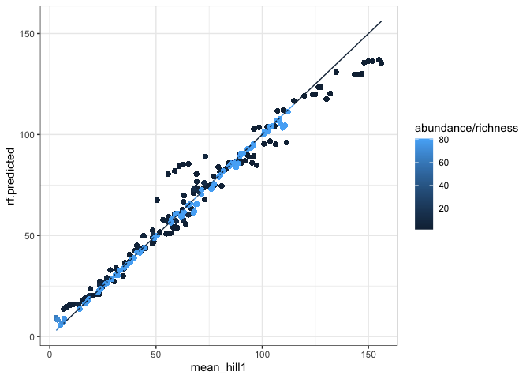
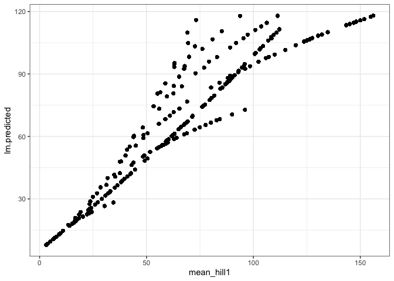

random forest
================

``` r
targets::tar_load("all", store = here::here("_targets"))
```

``` r
set.seed(1989)
all_combos <- all %>%
  select(richness, abundance) %>%
  distinct()

all_training_rows <- sample.int(nrow(all_combos), size = round(nrow(all_combos)/2), replace = F)

all_training_combos <- all_combos[all_training_rows, ]
all_test_combos <- all_combos[-all_training_rows, ]

all_training <- all_training_combos %>%
  left_join(all)
```

    ## Joining, by = c("richness", "abundance")

``` r
all_test <- all_test_combos %>%
  left_join(all)
```

    ## Joining, by = c("richness", "abundance")

``` r
all.rf <- randomForest(hill1 ~ richness + abundance, data = all_training, xtest = select(all_test, richness, abundance), ytest = all_test$hill1)

all_test$rf.predicted <- all.rf$test$predicted

all_test <- all_test %>%
  group_by(richness, abundance) %>%
  mutate(mean_hill1 = mean(hill1)) %>%
  ungroup()

ggplot(all_test, aes(mean_hill1, rf.predicted, color = abundance/richness))+
  geom_point() +
  geom_line(aes(y = mean_hill1))
```

<!-- -->

``` r
all.lm <- lm(hill1 ~ richness + abundance, data = all_training)

all_test$lm.predicted <- predict(all.lm, newdata = all_test[, c("richness", "abundance")])

ggplot(all_test, aes(mean_hill1, lm.predicted))+
  geom_point() 
```

<!-- -->

``` r
summary(all.lm)
```

    ## 
    ## Call:
    ## lm(formula = hill1 ~ richness + abundance, data = all_training)
    ## 
    ## Residuals:
    ##     Min      1Q  Median      3Q     Max 
    ## -70.947  -5.026   0.365   6.307  64.508 
    ## 
    ## Coefficients:
    ##               Estimate Std. Error t value Pr(>|t|)    
    ## (Intercept)  5.691e+00  5.810e-02   97.95   <2e-16 ***
    ## richness     5.646e-01  5.462e-04 1033.75   <2e-16 ***
    ## abundance   -3.102e-04  7.092e-06  -43.75   <2e-16 ***
    ## ---
    ## Signif. codes:  0 '***' 0.001 '**' 0.01 '*' 0.05 '.' 0.1 ' ' 1
    ## 
    ## Residual standard error: 14.97 on 262997 degrees of freedom
    ## Multiple R-squared:  0.8201, Adjusted R-squared:  0.8201 
    ## F-statistic: 5.995e+05 on 2 and 262997 DF,  p-value: < 2.2e-16
