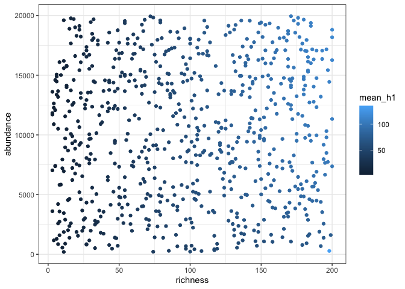
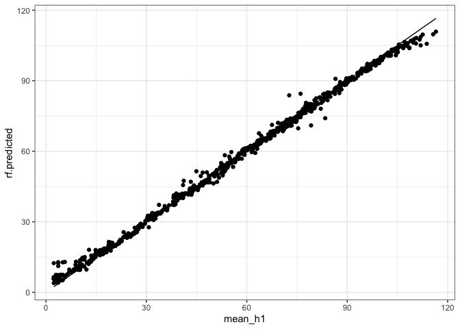
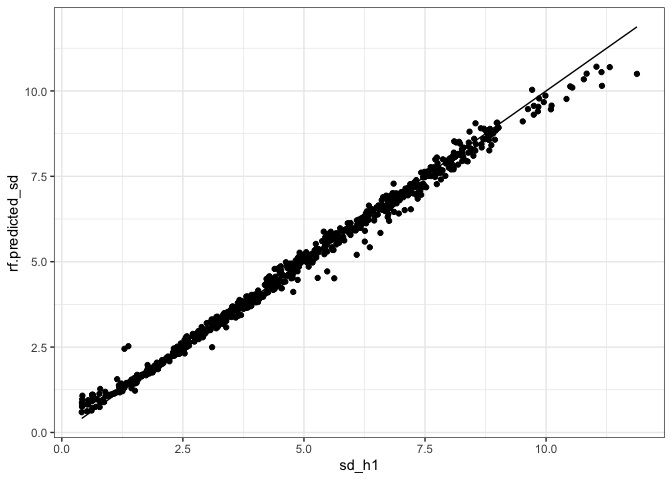
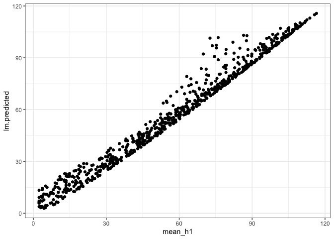

random forest
================

``` r
targets::tar_load("all", store = here::here("_targets"))
```

``` r
set.seed(1989)
all_combos <- all %>%
  group_by(richness, abundance) %>%
  summarize(mean_h1 = mean(hill1),
            sd_h1 = sd(hill1),
            n_h1 = length(unique(hill1))) %>%
  ungroup() %>%
  filter(n_h1 == 1000)
```

    ## `summarise()` has grouped output by 'richness'. You can override using the
    ## `.groups` argument.

``` r
all_training_rows <- sample.int(nrow(all_combos), size = round(nrow(all_combos)/2), replace = F)

all_training <- all_combos[all_training_rows, ]
all_test <- all_combos[-all_training_rows, ]
```

``` r
ggplot(all_training, aes(richness, abundance, color = mean_h1)) +
  geom_point()
```

<!-- -->

``` r
all.rf <- randomForest(mean_h1 ~ richness + abundance, data = all_training, xtest = select(all_test, richness, abundance), ytest = all_test$mean_h1)

all_test$rf.predicted <- all.rf$test$predicted


ggplot(all_test, aes(mean_h1, rf.predicted))+
  geom_point() +
  geom_line(aes(y = mean_h1))
```

<!-- -->

``` r
allsd.rf <- randomForest(sd_h1 ~ richness + abundance, data = all_training, xtest = select(all_test, richness, abundance), ytest = all_test$sd_h1)

all_test$rf.predicted_sd <- allsd.rf$test$predicted


ggplot(all_test, aes(sd_h1, rf.predicted_sd))+
  geom_point() +
  geom_line(aes(y = sd_h1))
```

<!-- -->

``` r
all.lm <- lm(mean_h1 ~ richness + abundance, data = all_training)

all_test$lm.predicted <- predict(all.lm, newdata = all_test[, c("richness", "abundance")])

ggplot(all_test, aes(mean_h1, lm.predicted))+
  geom_point() 
```

<!-- -->

``` r
summary(all.lm)
```

    ## 
    ## Call:
    ## lm(formula = mean_h1 ~ richness + abundance, data = all_training)
    ## 
    ## Residuals:
    ##     Min      1Q  Median      3Q     Max 
    ## -27.611  -2.568   1.542   3.697  34.579 
    ## 
    ## Coefficients:
    ##               Estimate Std. Error t value Pr(>|t|)    
    ## (Intercept) -1.719e+00  5.225e-01  -3.289  0.00105 ** 
    ## richness     5.158e-01  3.424e-03 150.617  < 2e-16 ***
    ## abundance    7.430e-04  3.514e-05  21.140  < 2e-16 ***
    ## ---
    ## Signif. codes:  0 '***' 0.001 '**' 0.01 '*' 0.05 '.' 0.1 ' ' 1
    ## 
    ## Residual standard error: 5.395 on 729 degrees of freedom
    ## Multiple R-squared:  0.9698, Adjusted R-squared:  0.9697 
    ## F-statistic: 1.169e+04 on 2 and 729 DF,  p-value: < 2.2e-16
