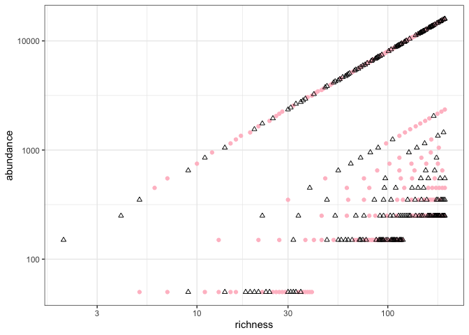
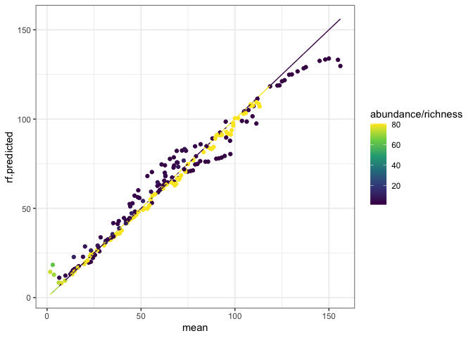
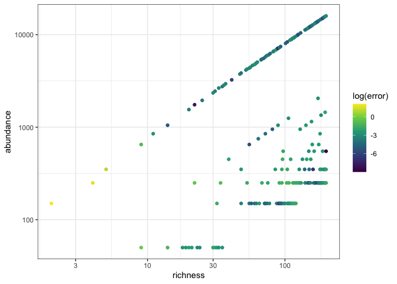
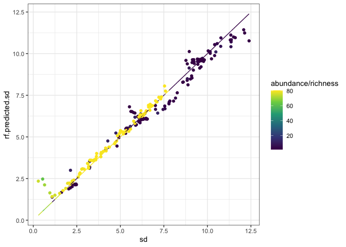
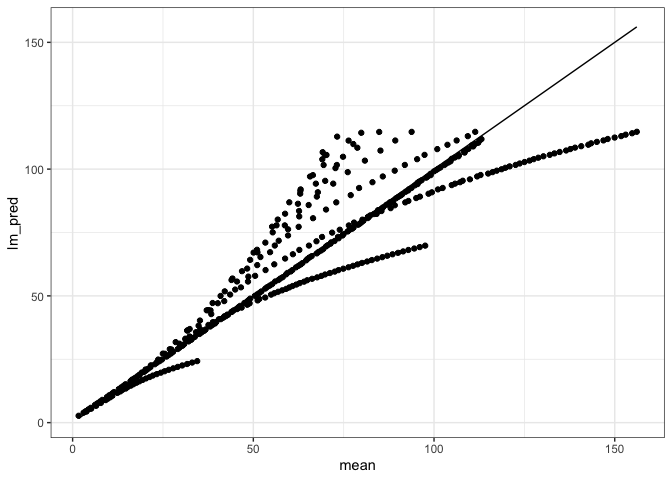
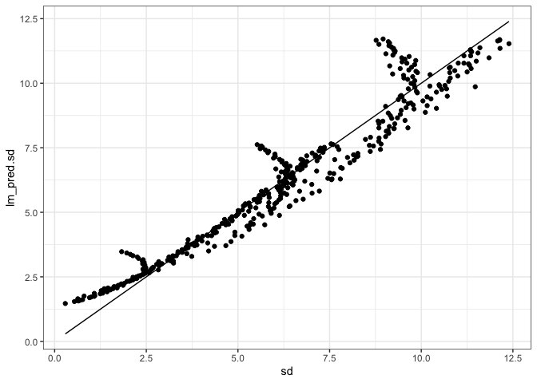
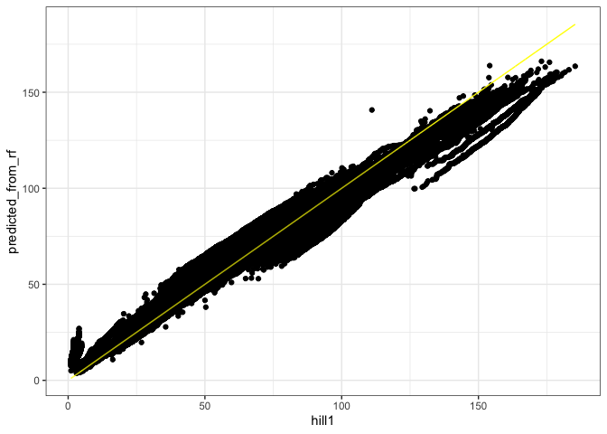
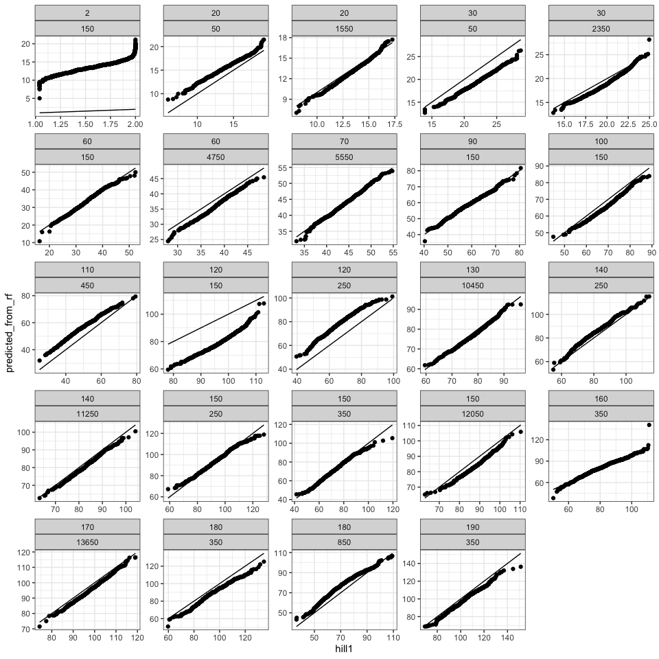

Sparse RF
================

``` r
targets::tar_load("all", store = here::here("_targets"))
```

``` r
#set.seed(1989)
all_combos <- all %>%
  group_by(richness, abundance) %>%
  summarize(mean = mean(hill1),
            sd = sd(hill1))
```

    ## `summarise()` has grouped output by 'richness'. You can override using the
    ## `.groups` argument.

``` r
all_training_rows <- sample.int(nrow(all_combos), size = round(nrow(all_combos)/2), replace = F)

all_training <- all_combos[all_training_rows, ]
all_test<- all_combos[-all_training_rows, ]

ggplot(all_training, aes(richness, abundance)) +
  geom_point(color = "pink") +
  geom_point(data = all_test, shape = 2) +
  scale_y_log10() +
  scale_x_log10()
```

<!-- -->

``` r
all.rf <- randomForest(mean ~ richness + abundance, data = all_training, xtest = select(all_test, richness, abundance), ytest = all_test$mean)


all_test$rf.predicted <- all.rf$test$predicted


ggplot(all_test, aes(mean, rf.predicted, color = abundance/richness))+
  geom_point() +
  geom_line(aes(y = mean)) +
  scale_color_viridis_c()
```

<!-- -->

``` r
all.rf
```

    ## 
    ## Call:
    ##  randomForest(formula = mean ~ richness + abundance, data = all_training,      xtest = select(all_test, richness, abundance), ytest = all_test$mean) 
    ##                Type of random forest: regression
    ##                      Number of trees: 500
    ## No. of variables tried at each split: 1
    ## 
    ##           Mean of squared residuals: 27.93979
    ##                     % Var explained: 97.66
    ##                        Test set MSE: 37.05
    ##                     % Var explained: 96.9

``` r
all_test$error <- abs(all_test$rf.predicted - all_test$mean) / all_test$mean

ggplot(all_test, aes(richness, abundance, color = log(error))) +
  geom_point() +
  scale_x_log10() +
  scale_y_log10() +
  scale_color_viridis_c()
```

<!-- -->

``` r
allsd.rf <- randomForest(sd ~ richness + abundance, data = all_training, xtest = select(all_test, richness, abundance), ytest = all_test$mean)


all_test$rf.predicted.sd <- allsd.rf$test$predicted


ggplot(all_test, aes(sd, rf.predicted.sd, color = abundance/richness))+
  geom_point() +
  geom_line(aes(y = sd)) +
  scale_color_viridis_c()
```

<!-- -->

``` r
allsd.rf
```

    ## 
    ## Call:
    ##  randomForest(formula = sd ~ richness + abundance, data = all_training,      xtest = select(all_test, richness, abundance), ytest = all_test$mean) 
    ##                Type of random forest: regression
    ##                      Number of trees: 500
    ## No. of variables tried at each split: 1
    ## 
    ##           Mean of squared residuals: 0.1655273
    ##                     % Var explained: 98.24
    ##                        Test set MSE: 4503.75
    ##                     % Var explained: -277.34

``` r
mean.lm <- lm(mean ~ richness* abundance, data=all_combos)
mean.lm
```

    ## 
    ## Call:
    ## lm(formula = mean ~ richness * abundance, data = all_combos)
    ## 
    ## Coefficients:
    ##        (Intercept)            richness           abundance  richness:abundance  
    ##          1.458e+00           5.694e-01           7.682e-04          -4.789e-06

``` r
summary(mean.lm)
```

    ## 
    ## Call:
    ## lm(formula = mean ~ richness * abundance, data = all_combos)
    ## 
    ## Residuals:
    ##     Min      1Q  Median      3Q     Max 
    ## -39.619  -2.261   0.423   1.888  41.380 
    ## 
    ## Coefficients:
    ##                      Estimate Std. Error t value Pr(>|t|)    
    ## (Intercept)         1.458e+00  1.682e+00   0.867    0.387    
    ## richness            5.694e-01  1.364e-02  41.743   <2e-16 ***
    ## abundance           7.682e-04  5.492e-04   1.399    0.163    
    ## richness:abundance -4.789e-06  3.500e-06  -1.368    0.172    
    ## ---
    ## Signif. codes:  0 '***' 0.001 '**' 0.01 '*' 0.05 '.' 0.1 ' ' 1
    ## 
    ## Residual standard error: 13.37 on 413 degrees of freedom
    ## Multiple R-squared:  0.852,  Adjusted R-squared:  0.8509 
    ## F-statistic: 792.4 on 3 and 413 DF,  p-value: < 2.2e-16

``` r
all_combos$lm_pred <- predict(mean.lm)

ggplot(all_combos, aes(mean, lm_pred)) + 
  geom_point() +
  geom_line(aes(y = mean))
```

<!-- -->

``` r
sd.lm <- lm(sd ~ richness* abundance, data=all_combos)
sd.lm
```

    ## 
    ## Call:
    ## lm(formula = sd ~ richness * abundance, data = all_combos)
    ## 
    ## Coefficients:
    ##        (Intercept)            richness           abundance  richness:abundance  
    ##          1.404e+00           5.213e-02          -2.769e-04           9.140e-08

``` r
summary(sd.lm)
```

    ## 
    ## Call:
    ## lm(formula = sd ~ richness * abundance, data = all_combos)
    ## 
    ## Residuals:
    ##      Min       1Q   Median       3Q      Max 
    ## -2.89285 -0.28170  0.00798  0.52614  1.61006 
    ## 
    ## Coefficients:
    ##                      Estimate Std. Error t value Pr(>|t|)    
    ## (Intercept)         1.404e+00  9.774e-02  14.365   <2e-16 ***
    ## richness            5.213e-02  7.928e-04  65.762   <2e-16 ***
    ## abundance          -2.769e-04  3.192e-05  -8.676   <2e-16 ***
    ## richness:abundance  9.140e-08  2.034e-07   0.449    0.653    
    ## ---
    ## Signif. codes:  0 '***' 0.001 '**' 0.01 '*' 0.05 '.' 0.1 ' ' 1
    ## 
    ## Residual standard error: 0.7768 on 413 degrees of freedom
    ## Multiple R-squared:  0.9317, Adjusted R-squared:  0.9312 
    ## F-statistic:  1877 on 3 and 413 DF,  p-value: < 2.2e-16

``` r
all_combos$lm_pred.sd <- predict(sd.lm)

ggplot(all_combos, aes(sd, lm_pred.sd)) + 
  geom_point() +
  geom_line(aes(y = sd))
```

<!-- -->

``` r
gen_hill_draws <- function(a_row) {
  
  vals <- rnorm(1000, mean = a_row[5], sd = a_row[7])
  
  return(data.frame(richness = a_row[1],
                    abundance = a_row[2],
                    hill_from_rf = vals))
  
}

pull_real_vals <- function(a_row, all_draws) {
  
  avail_vals <- filter(all_draws, richness == a_row[1],
                       abundance == a_row[2]) %>%
    select(richness, abundance, hill1)
  
  avail_vals <- avail_vals[1:(min(nrow(avail_vals), 1000)),]
  
  avail_vals
}
```

``` r
hill_preds <- apply(all_test, 1, FUN = gen_hill_draws)

hill_preds <- bind_rows(hill_preds)

real_hills <- apply(all_test, 1, FUN = pull_real_vals, all_draws = all)

real_hills <- bind_rows(real_hills)

all(real_hills$abundance == hill_preds$abundance)
```

    ## [1] TRUE

``` r
all(real_hills$richness == hill_preds$richness)
```

    ## [1] TRUE

``` r
preds_compare <- real_hills %>%
  mutate(predicted_from_rf = hill_preds$hill_from_rf) %>%
  group_by(richness, abundance) %>%
  mutate(predicted_from_rf = sort(predicted_from_rf),
         hill1 = sort(hill1)) %>%
  ungroup()

ggplot(preds_compare, aes(hill1, predicted_from_rf)) + 
  geom_point() +
  geom_line(aes(y = hill1), color = "yellow")
```

<!-- -->

``` r
ggplot(filter(preds_compare, richness %in% c(min(richness), seq(0, 200, by = 10))), aes(hill1, predicted_from_rf)) +
  geom_point() +
  geom_line(aes(y = hill1)) +
  facet_wrap(vars(richness, abundance), scales = "free")
```

<!-- -->
