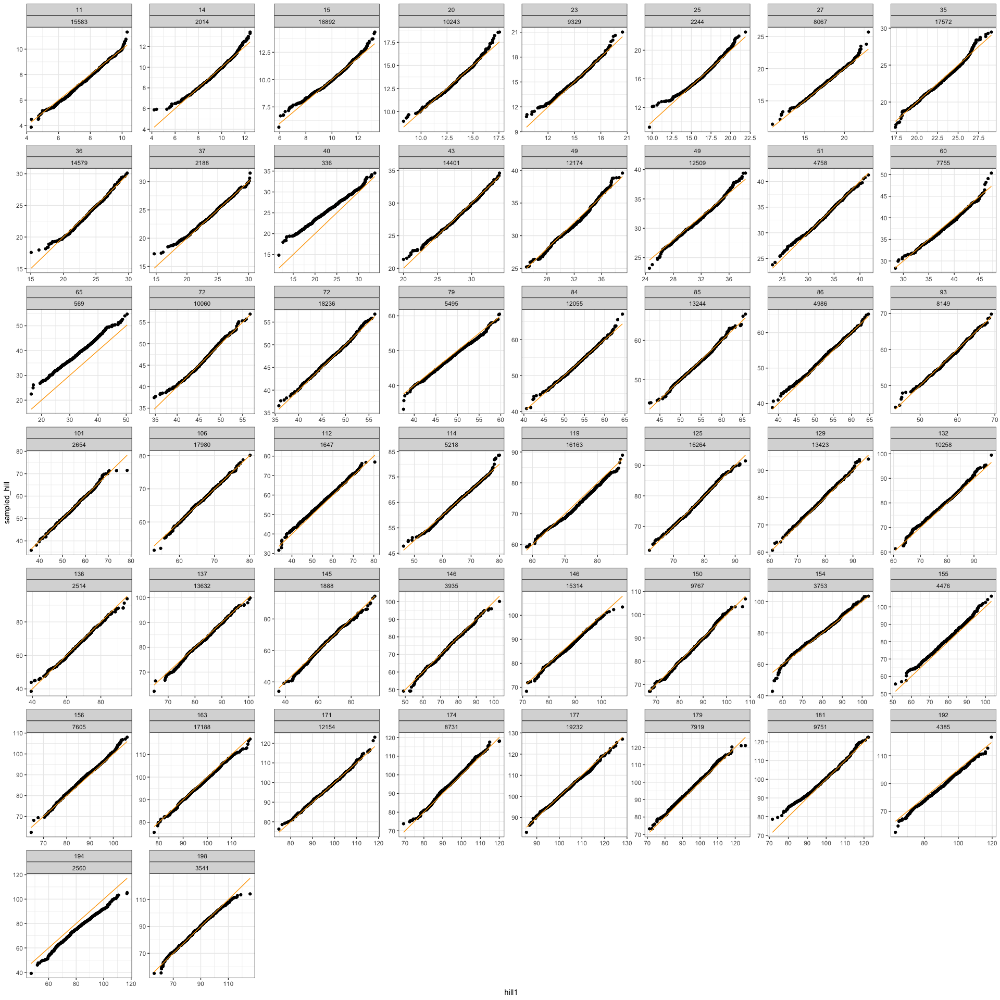
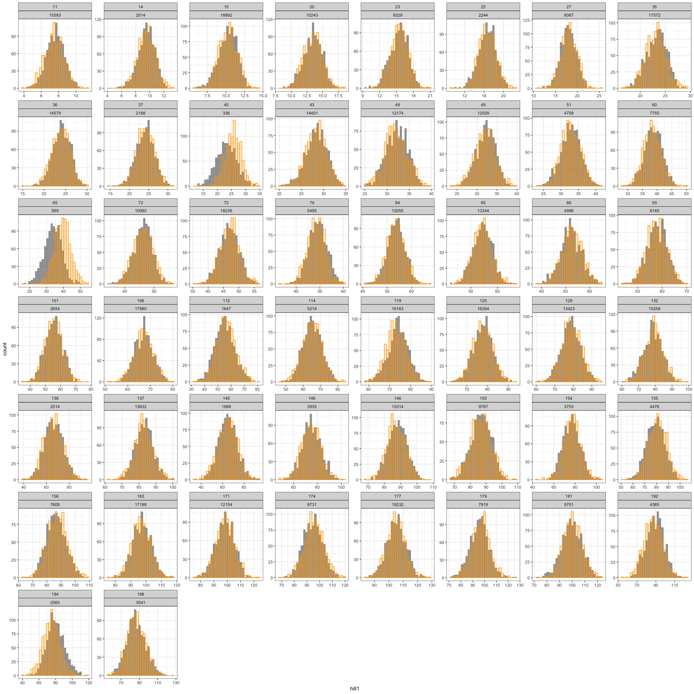
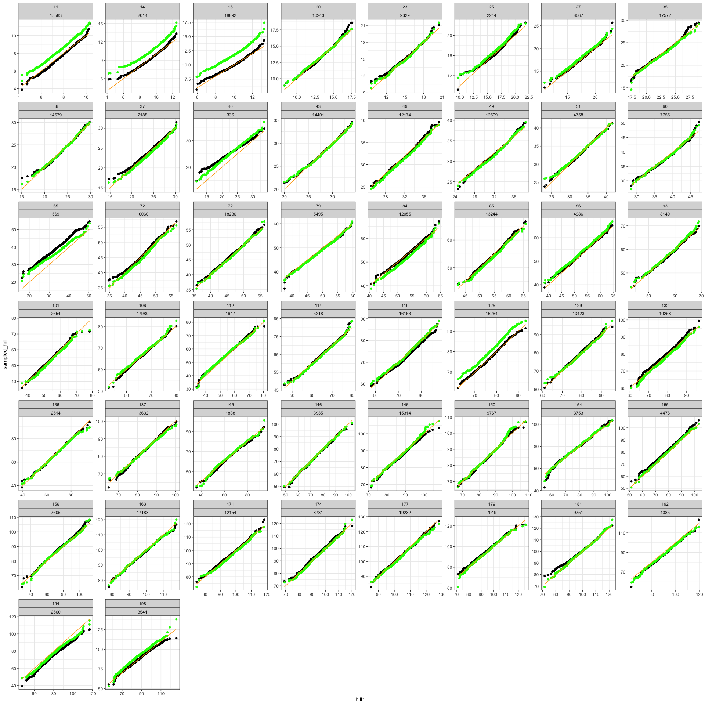
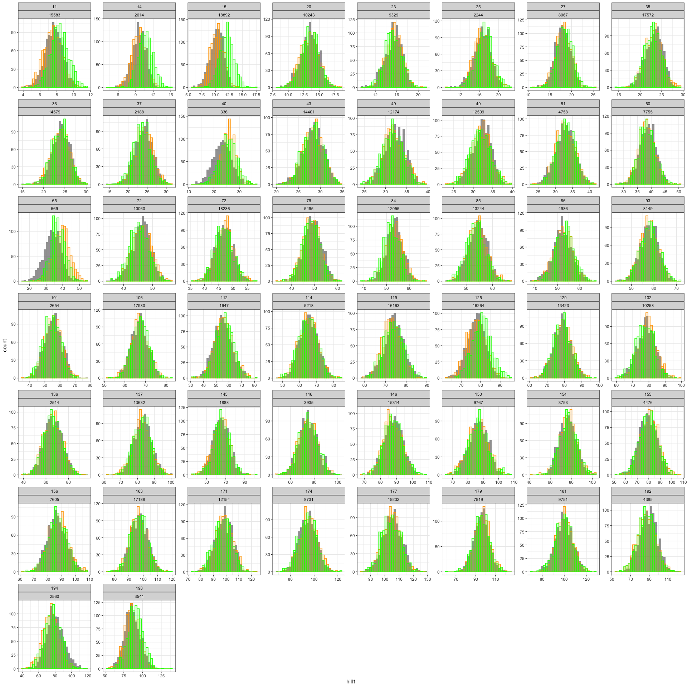

Random forest - FS comparisons
================

``` r
set.seed(1988)

rf_fs <- read.csv(here::here("mod_compare", "rf_and_fs_samples.csv"))

head(rf_fs)
```

    ##   X sampled_hill richness abundance    hill1
    ## 1 0     1.085190        3      3606 1.148415
    ## 2 1     1.155295        3      3606 1.154451
    ## 3 2     1.187851        3      3606 1.170528
    ## 4 3     1.226245        3      3606 1.176418
    ## 5 4     1.282522        3      3606 1.182063
    ## 6 5     1.334470        3      3606 1.185470

``` r
short_rf_fs_combos <- rf_fs %>%
  select(richness, abundance) %>%
  distinct()

short_rf_fs_combos <- short_rf_fs_combos[ sample(nrow(short_rf_fs_combos), 50, F), ]
short_rf_fs_combos <- short_rf_fs_combos %>%
  left_join(rf_fs, by = c("richness", "abundance"))
```

``` r
full_lineplot <- ggplot(short_rf_fs_combos, aes(hill1, sampled_hill)) +
  geom_point() +
  geom_line(aes(y = hill1), color = "orange") +
  facet_wrap(vars(richness, abundance), scales = "free")
full_lineplot
```

<!-- -->

``` r
short_rf_fs_combos_long <- short_rf_fs_combos %>%
  select(-X) %>%
  tidyr::pivot_longer(-c(richness, abundance), names_to = "src", values_to = 'h')


full_distplot <- ggplot(short_rf_fs_combos, aes(hill1)) +
  geom_histogram(alpha = .6) +
  geom_histogram(aes(x = sampled_hill), alpha = .2, color = "orange", fill = "orange") + 
  facet_wrap(vars(richness, abundance), scales = "free")

full_distplot
```

    ## `stat_bin()` using `bins = 30`. Pick better value with `binwidth`.
    ## `stat_bin()` using `bins = 30`. Pick better value with `binwidth`.

<!-- -->

``` r
r_fs_samples <- read.csv(here::here("rf_from_r_sims.csv"))


unique_combos <- short_rf_fs_combos %>%
  select(richness, abundance) %>%
  distinct()

full_combos <- list() 


for(i in 1:nrow(unique_combos)) {
  
  skl_combos <- filter(short_rf_fs_combos, richness == unique_combos$richness[i], abundance == unique_combos$abundance[i])
  r_combos <- filter(r_fs_samples, richness == unique_combos$richness[i], abundance == unique_combos$abundance[i])
  
  all_combos <- skl_combos %>%
    mutate(r_sampled_hill = r_combos$r_sampled_hill1)
  
  full_combos[[i]] <- all_combos
  
  
}
```

``` r
full_combos <- bind_rows(full_combos)
```

``` r
full_lineplot2 <- ggplot(full_combos, aes(hill1, sampled_hill)) +
  geom_point() +
  geom_point(aes(y = r_sampled_hill), color = "green") +
  geom_line(aes(y = hill1), color = "orange") +
  facet_wrap(vars(richness, abundance), scales = "free")
full_lineplot2
```

<!-- -->

``` r
full_distplot2 <- ggplot(full_combos, aes(hill1)) +
  geom_histogram(alpha = .6) +
  geom_histogram(aes(x = sampled_hill), alpha = .2, color = "orange", fill = "orange") + 
  geom_histogram(aes(x = r_sampled_hill), alpha = .2, color = "green", fill = "green") +
  facet_wrap(vars(richness, abundance), scales = "free")

full_distplot2
```

    ## `stat_bin()` using `bins = 30`. Pick better value with `binwidth`.
    ## `stat_bin()` using `bins = 30`. Pick better value with `binwidth`.
    ## `stat_bin()` using `bins = 30`. Pick better value with `binwidth`.

<!-- -->
